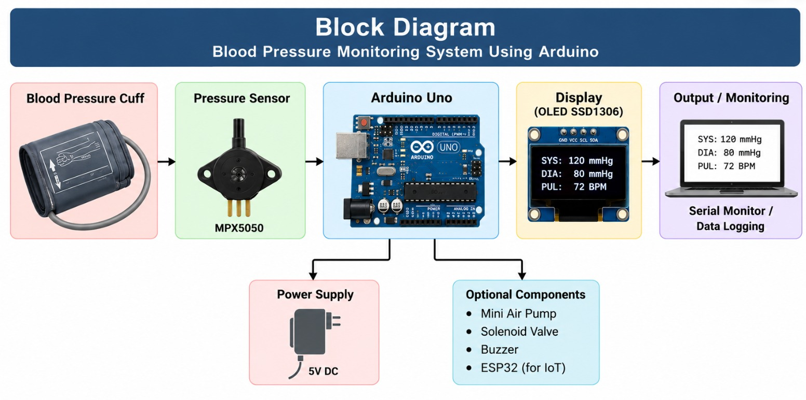
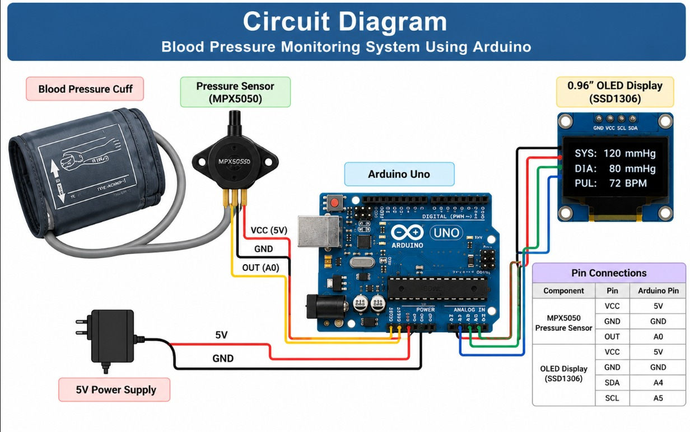

# Blood Pressure Monitoring System Using Arduino

An Arduino-based blood pressure monitoring prototype designed to measure and display blood pressure parameters such as systolic pressure, diastolic pressure, and pulse rate.

##  Overview

This project focuses on developing a low-cost embedded system for blood pressure monitoring using an Arduino microcontroller, pressure sensor, blood pressure cuff, and OLED display.

The pressure signal obtained from the cuff is acquired by the Arduino and processed to estimate the required blood pressure parameters. The results can then be displayed locally and monitored through the Serial Monitor.

>  **Disclaimer:** This project is intended for educational and experimental purposes only. It is not a medically certified device and must not be used for medical diagnosis or clinical decisions.

---

##  Objectives

- Interface a pressure sensor with an Arduino microcontroller.
- Acquire pressure data from a blood pressure cuff.
- Process the acquired pressure signal.
- Estimate systolic and diastolic blood pressure.
- Monitor pulse rate.
- Display measurements on an OLED/LCD.
- Provide serial monitoring for debugging and data logging.
- Develop a foundation for future IoT-based health monitoring.

---

##  Hardware Components

Arduino Uno
Blood Pressure Cuff
Pressure Sensor
0.96" OLED Display (SSD1306)
Breadboard
Jumper Wires
USB Cable
Power Supply

##  Software Requirements

- Arduino IDE
- Arduino C/C++
- OLED display libraries
- Wire/I2C library

##  Working Principle

1. The blood pressure cuff is placed around the upper arm.
2. The cuff pressure is measured using a pressure sensor.
3. The pressure sensor converts the pressure into an electrical signal.
4. The Arduino reads the sensor output through an analog input.
5. The acquired signal is processed to identify pressure variations.
6. The system estimates systolic and diastolic blood pressure.
7. Pulse rate can also be extracted from the pressure signal.
8. The results are displayed on the OLED/LCD.
9. The measurements can also be observed through the Serial Monitor.

## Project Documentation

### Block Diagram



### Circuit Diagram


##  System Architecture

```text
┌─────────────────────┐
│  Blood Pressure     │
│       Cuff          │
└──────────┬──────────┘
           │
           ▼
┌─────────────────────┐
│   Pressure Sensor   │
└──────────┬──────────┘
           │
           │ Analog Signal
           ▼
┌─────────────────────┐
│     Arduino Uno     │
│                     │
│  Signal Processing  │
│  Data Acquisition   │
│  BP Estimation      │
└──────────┬──────────┘
           │
      ┌────┴─────┐
      │          │
      ▼          ▼
┌──────────┐  ┌───────────────┐
│ OLED/LCD │  │ Serial Monitor│
│ Display  │  │ / Data Logging│
└──────────┘  └───────────────┘
